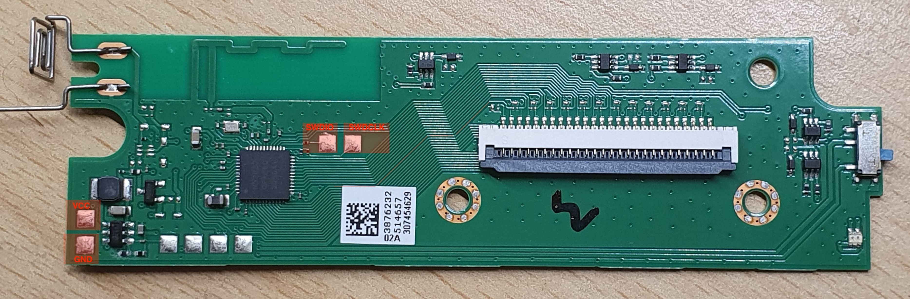

# Zephyr™ Mechanical Keyboard (ZMK) Firmware

[](https://zmk.dev/community/discord/invite)
[](https://github.com/zmkfirmware/zmk/actions)
[](CODE_OF_CONDUCT.md)

[ZMK Firmware](https://zmk.dev/) is an open source ([MIT](LICENSE)) keyboard firmware built on the [Zephyr™ Project](https://www.zephyrproject.org/) Real Time Operating System (RTOS). ZMK's goal is to provide a modern, wireless, and powerful firmware free of licensing issues.

Check out the website to learn more: https://zmk.dev/.

You can also come join our [ZMK Discord Server](https://zmk.dev/community/discord/invite).

To review features, check out the [feature overview](https://zmk.dev/docs/). ZMK is under active development, and new features are listed with the [enhancement label](https://github.com/zmkfirmware/zmk/issues?q=is%3Aissue+is%3Aopen+label%3Aenhancement) in GitHub. Please feel free to add 👍 to the issue description of any requests to upvote the feature.

## Board: k380s

Custom board for the K380s (nRF52832 QFAB, BLE-only) mainboard used in a
Logitech K380s shell. `app/boards/nordic/k380s/`. Pin functions below were
reverse-engineered via brute-force GPIO scanning and hardware testing (no
schematic available), so treat unlisted pins/behaviors as unknown rather
than confirmed-absent.

> **⚠️ Keymap layout warning**: `k380s.keymap` uses US/QWERTY HID keycodes
> matched to physical key position, not to any printed legend. If your OS
> keyboard layout is set to AZERTY, typed characters will **not** match
> this keyboard's printed legends - set the OS layout to US/QWERTY, or
> remap the keymap bindings to match AZERTY key positions instead.

### GPIO map (P0.0 - P0.31, all 32 pins in use)

| Pin(s)              | Function                          | Notes |
|---------------------|------------------------------------|-------|
| P0.0-P0.8, P0.28-29  | Key matrix rows                    | `GPIO_ACTIVE_HIGH \| GPIO_OPEN_SOURCE` |
| P0.9-P0.22          | Key matrix columns                 | `GPIO_ACTIVE_HIGH \| GPIO_PULL_DOWN`. P0.9/P0.10 are the SoC's NFC antenna pins by default - freed for GPIO use via `&uicr { nfct-pins-as-gpios; }` |
| P0.23               | Green LED                          | Plain `gpio-leds`, active high |
| P0.24               | Red LED                            | Lowest forward voltage of the 5 LEDs - confirmed working on the 2-cell NiMH pack |
| P0.25               | White LED 1                        | Used as the ZMK status LED (advertising/connected/battery blink) |
| P0.26               | White LED 2                        | Unused by firmware, same behavior as White LED 1 |
| P0.27               | White LED 3                        | Unused by firmware, same behavior as White LED 1 |
| P0.30 (AIN6)        | Battery voltage sense              | 2-cell NiMH pack wired directly to the ADC, no physical divider. See the calibration comment on `vbatt` in the board dts - the driver's fixed Li-ion SoC curve is approximated with a scaled `full-ohms` |
| P0.31               | LED bank power enable              | Must be driven **high** or none of the 5 LEDs above light up, regardless of their own GPIO state. Modeled as a `zmk,ext-power-generic` device (`EXT_POWER` node) rather than a static `gpio-hog` so it gets cleanly disabled by ZMK's device-suspend path before `sys_poweroff()` (deep sleep) and re-enabled again on the next boot |

### Known quirks

- **Deep sleep and LED power**: `CONFIG_ZMK_SLEEP` selects
  `ZMK_PM_DEVICE_SUSPEND_RESUME`, so `zmk_pm_suspend_devices()` runs
  `PM_DEVICE_ACTION_SUSPEND` on every eligible device before `sys_poweroff()`.
  The `ext_power_generic` driver backing P0.31 handles that action by
  driving the pin low, so the whole LED bank is powered down during deep
  sleep and comes back automatically on wake (fresh boot re-enables it in
  `ext_power_generic_init`).
- **Battery percentage accuracy**: the voltage-divider driver only supports
  a fixed lithium-ion state-of-charge curve in this ZMK version. The
  `full-ohms` value on `vbatt` is a linear-fit approximation for a 2-cell
  NiMH pack, not a real physical divider ratio - expect the reported
  percentage to be approximate, especially near the extremes.

### Flashing: SWD wiring

The board has no exposed debug connector - wire a J-Link (or other SWD probe)
directly to the four pads shown below (front side of the board):



| Pad    | Probe pin | Location on board |
|--------|-----------|--------------------|
| VCC    | VTref/VCC | Bottom-left, next to GND |
| GND    | GND       | Bottom-left, next to VCC |
| SWDIO  | SWDIO     | Small pad next to the MCU, left of SWDCLK |
| SWDCLK | SWDCLK    | Small pad next to the MCU, right of SWDIO |

The battery pack powers the board during flashing - VCC only needs to be
tied to the probe's VTref sense line, not driven; the nRF52832 has no USB.

Flashing was done from a Raspberry Pi acting as the SWD probe, driving
SWDIO/SWDCLK directly from its GPIO header via OpenOCD's `bcm2835gpio`
bit-banged adapter - no dedicated J-Link/ST-Link hardware needed. GND/VCC
still need to be wired between the Pi and the board as above.

`openocd.cfg` used on the Pi (Raspberry Pi 3, BCM2837):

```
interface bcm2835gpio

# Raspi1 peripheral_base address
# bcm2835gpio_peripheral_base 0x20000000
# Raspi2 and Raspi3 peripheral_base address
bcm2835gpio_peripheral_base 0x3F000000

# Raspi1 BCM2835: (700Mhz)
# bcm2835gpio_speed_coeffs 113714 28
# Raspi2 BCM2836 (900Mhz):
# bcm2835gpio_speed_coeffs 146203 36
# Raspi3 BCM2837 (1200Mhz):
bcm2835gpio_speed_coeffs 194938 48

# SWD GPIO set: swclk swdio
bcm2835gpio_swd_nums 25 24

transport select swd

set CHIPNAME nrf52832
source [find target/nrf52.cfg]

# Uncomment & lower speed to address errors
adapter_khz 1000

init
nrf52_recover
program zmk.hex verify reset
rtt setup 0x20000410 0x8000 "SEGGER RTT"
rtt start
rtt server start 9090 0
```

SWCLK is on the Pi's BCM GPIO 25, SWDIO on BCM GPIO 24. `nrf52_recover` mass-erases
before flashing (needed since the chip ships APPROTECT-locked). The `rtt`
lines set up a TCP bridge (port 9090) to the firmware's SEGGER RTT log
buffer for live boot/debug output over the same SWD link.
